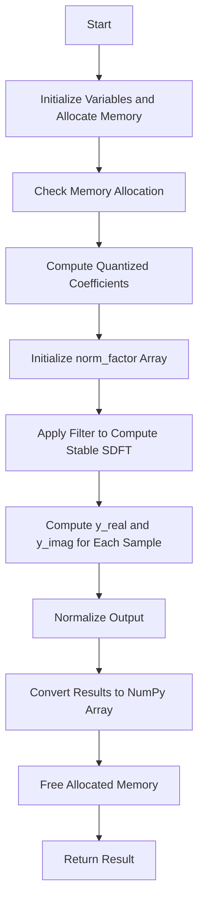

# Flowchart for `cython_stable_sdft` Function

## Flowchart



## Detailed Flowchart Description

1. **Start**
   - Initialization of the `cython_stable_sdft` function.

2. **Initialize Variables and Allocate Memory**
   - Initialize necessary variables such as `y_real`, `y_imag`, `norm_factor`, `exp_factor_real`, `exp_factor_imag`, `cos_factor`, `B_real`, `B_imag`, and `A`.
   - Allocate memory for `y_real`, `y_imag`, and `norm_factor`.

3. **Check Memory Allocation**
   - Check if memory allocation was successful. If not, raise a `MemoryError`.

4. **Compute Quantized Coefficients**
   - Compute and quantize the coefficients for the filter:
     - `exp_factor_real` and `exp_factor_imag` for the exponential factor.
     - `cos_factor` for the cosine factor.
   - Quantize these coefficients to ensure precision.

5. **Initialize norm_factor Array**
   - Initialize the `norm_factor` array to 1.0 (simplified normalization).

6. **Apply Filter to Compute Stable SDFT**
   - Apply the filter to compute the stable SDFT for each sample in the signal:
     - Loop over each sample in the signal:
       - **Compute y_real and y_imag for Each Sample**
         - For each sample, compute the real part (`y_real`) and imaginary part (`y_imag`) of the output using the quantized coefficients and previous samples.
         - Apply feedback using the `A` coefficients.

7. **Normalize Output**
   - Normalize the output by dividing `y_real` and `y_imag` by the `norm_factor`.

8. **Convert Results to NumPy Array**
   - Convert the results (`y_real` and `y_imag`) to a NumPy array of complex numbers.

9. **Free Allocated Memory**
   - Free the allocated memory for `y_real`, `y_imag`, and `norm_factor`.

10. **Return Result**
    - Return the final result as a NumPy array of complex numbers.
```